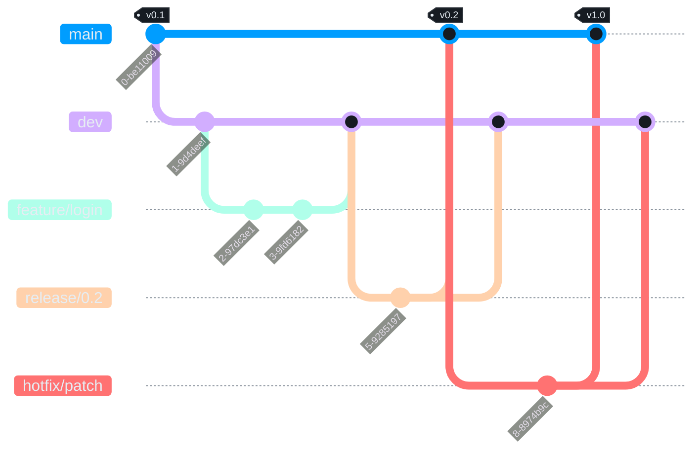

# Git Flow Branching Model

## Branch Types
- `main`: Production-ready code only.
- `dev`: Integration branch for completed work.
- `feature/*`: New feature development, branched from `dev`.
- `release/*`: Release stabilization, branched from `dev`.
- `hotfix/*`: Emergency fixes, branched from `main`.

## Usage Rules
- No direct pushes to `main` or `dev`.
- All changes merge via pull requests.
- `feature/*` merges into `dev`.
- `release/*` merges into `main` and back into `dev`.
- `hotfix/*` merges into `main` and back into `dev`.

## Branch Protection Rules
Apply these settings in GitHub repository settings:

- Protect `main` and `dev`
- Require pull request reviews before merging (minimum 1 approval)
- Require status checks to pass (Jenkins)
- Require branches to be up to date before merging
- Restrict force pushes
- Disallow direct pushes

## Branch Lifecycle example 
This is an example of how the Git Flow Branching model will work on our project

